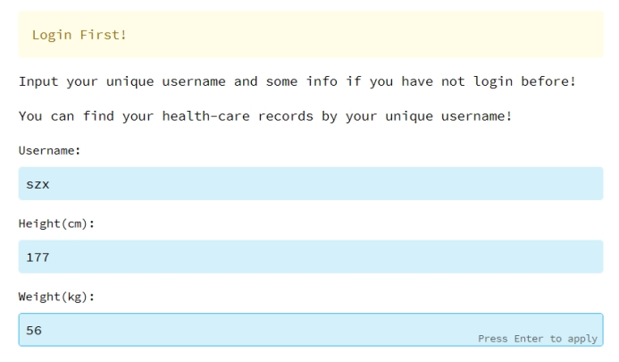

# 健康数据管家

## **一、** 技术栈⭐

前端：Streamlit框架

后端：Python、MQTT

数据库：MySQL

## 二、具体说明:heart:

1.传感器模拟端：用户通过前端采集按钮开启传感器采集，采集得到的数据通过MQTT协议传送到后端云服务。

2.后端云服务：利用阿里RDS云数据库（MySQL）接收并处理来自传感器模拟端的数据，提供数据接口供前端调用，并管理数据的存储和更新。后端服务采用MQTT的服务架构，通过对topic数据的消耗来以便管理和调度数据流。编程语言采用Python。

3.前端展示端：采用streamlit框架从后端并展示实时传感器数据。

## 三、系统架构:house:

1.**系统整体架构**

系统整体架构如下，用户层主要面向用户和管理人员，可以通过PC端和小程序访问。通过接口层的API可以调用业务层的服务，主要服务有数据监听，包括心率监听、血压监听、大脑检测、肾脏数据检测。以及对各个数据的分析。数据访问层存储各个数据。第三方设施包括了阿里云、MySQL。

 

**2.Streamlit框架**

采用Streamlit框架，从上到下运行Python 脚本。每次打开指向应用程序的浏览器选项卡，或者用户与小部件交互时，脚本都会重新执行。随着脚本的执行，Streamlit 在浏览器中实时绘制其输出。使用 Streamlit 缓存来避免重新计算，更新快速。

 

## 四、数据模型:books:

系统数据模型设计如下，相关实体关系为，不同的用户将会对应不同的心率、大脑、肾脏、血压。各个实体所拥有的属性具体如下图。

 

## 五、具体页面:cake:

用户首先输入个人信息登录：

 

主界面：该界面左侧为小熊医生，告诉用户一些系统信息，右侧显示个人的身高、体重、BMI信息。

 

点击Monitor按钮开始检测用户健康信息：用户点击按钮后会触发传感器的执行，几秒的缓冲后，通过python的os.system命令控制MQTT服务器模拟数据产生与消耗：

 

 

 

随后检测的数据包括一下几类：

 

1、脑电波数据：这部分数据通过后端得到最近的10s内alpha，beta，theta和gamma脑电波d 模拟值，并会将最近10s内的最大值标黄显示：

 

2、血压数据：通过数据库查询得到用户最新当前的舒张压，收缩压和血压值，数据每隔1s更新一次，与此同时画出两条警戎线，若超过则会触发钉钉警报：

 

 

3.心电图：数据每隔1s更新一次，仿照华为运动，采用面积图表示心率，过低则会出发警报：

 

4.肾脏功能：数据每隔1s更新一次，模拟左肾和右肾的指标，利用柱状图表示。

 

## 六、核心代码:cactus:

- 前端模拟传感器采集数据：点击按钮触发run.sh文件。

```python
if st.button("Monitor"):
    with st.spinner('Starting…Just wait for a moment'):
        res=os.system("sh run.sh")
        time.sleep(3) 
```

- run.sh文件：

```sh
cd /d D:\IOT\sensor
python mqtt_receiver.py
python mqtt_sender.py 
```

- 实时更新数据：通过拼接dataframe实现。

```python
# 血压
df = get_data_bq()
bp = np.round(df.loc[0, 'bqlow'] / 3 + df.loc[0, 'bqhigh'] * 2 / 3, 0)
df2 = pd.DataFrame({
    'time': [df.loc[0, 'time']],
    'blood pressure': [bp],
    'diastolic pressure': [df.loc[0, 'bqhigh']],
    'systolic pressure': [df.loc[0, 'bqlow']],
    'high': [120],
    'low': [60],
})
last_rows_bq = pd.concat([last_rows_bq, df2])
chart_bq.line_chart(last_rows_bq.set_index('time'))
if df.loc[0, 'bqlow'] < 60:
    getDingMes("警报：血压过低")
    elif df.loc[0, 'bqhigh'] > 130:
        getDingMes("警报：血压过高") 
```

- 后端提供数据接口用于数据更新：

```python
def get_data_hr():
    db = pymysql.connect(host="223.5.208.153", user="user1", password="user@123", database="lot", charset="utf8")
    sql = "select * from hr where id = (select max(id) from hr)"
    cursor = db.cursor()
    cursor.execute(sql)
    db.commit()
    df = pd.read_sql(sql, con=db)
    return df


def get_data_k():
    db = pymysql.connect(host="223.5.208.153", user="user1", password="user@123", database="lot", charset="utf8")
    sql = "select * from kidney where id = (select max(id) from kidney)"
    cursor = db.cursor()
    cursor.execute(sql)
    db.commit()
    df = pd.read_sql(sql, con=db)
    return df
```

- 数据消耗并写入数据库：

```python
 def on_message(client: mqtt, userdata, msg):
        str_message = str(msg.payload.decode())
        message = json.dumps(str_message)
        message = eval(json.loads(message))
        if msg.topic == topic_bp:
            sql = "insert into bp (time,bqlow,bqhigh) values ('%s','%s','%s');" % (
                message['time'], message['bqlow'], message['bqhigh'])
            cursor.execute(sql)
            db.commit()
        elif msg.topic == topic_hr:
            sql = "insert into hr (time,heartrate) values ('%s','%s');" % (message['time'], message['heartrate'])
            cursor.execute(sql)
            db.commit()
        elif msg.topic == topic_kidney:
            sql = "insert into kidney (time,rightkidney,leftkidney) values ('%s','%s','%s');" % (
                message['time'], message['rightkidney'], message['leftkidney'])
            cursor.execute(sql)
            db.commit()
        else:
            sql = "insert into brain (time,alpha,beta,theta,gamma) values ('%s','%s','%s','%s','%s');" % (
                message['time'], message['alpha'], message['beta'], message['theta'], message['gamma'])
            cursor.execute(sql)
            db.commit()
        print(msg.topic)
        print(message)

```

- 传感器发生数据：

```python
# 发送消息
def publish(my_topic):
    msg = {}
    my_time = time.strftime("%H:%M:%S", time.localtime())
    if my_topic == topic_bp:
        msg['bqlow'] = random.randint(55, 90)
        msg['bqhigh'] = random.randint(90, 130)
        msg['time'] = my_time
    elif my_topic == topic_hr:
        msg['heartrate'] = random.randint(50, 130)
        msg['time'] = my_time
    elif my_topic == topic_kidney:
        msg['rightkidney'] = random.randint(30, 40)
        msg['leftkidney'] = random.randint(30, 40)
        msg['time'] = my_time
    else:
        msg['time'] = my_time
        msg['alpha'] = random.randint(15, 30)
        msg['beta'] = random.randint(15, 30)
        msg['theta'] = random.randint(15, 30)
        msg['gamma'] = random.randint(15, 30)

    mqtt_client.publish(my_topic, str(msg))
    return msg
 
```
